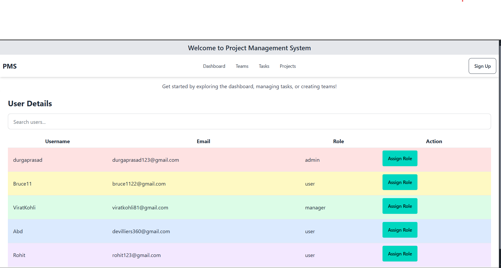
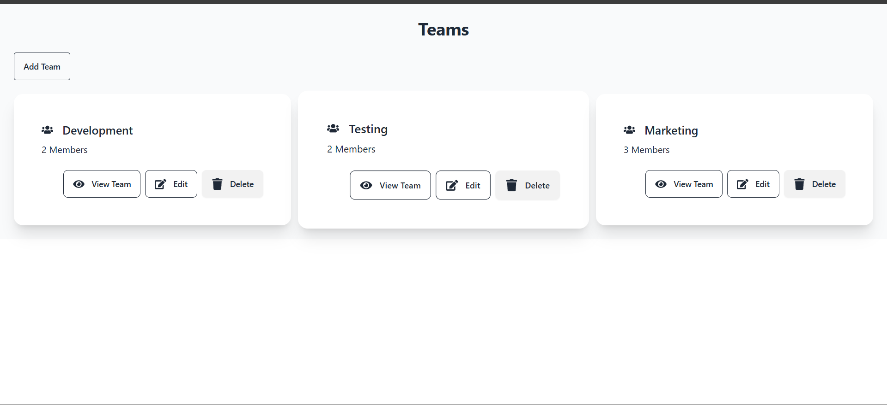
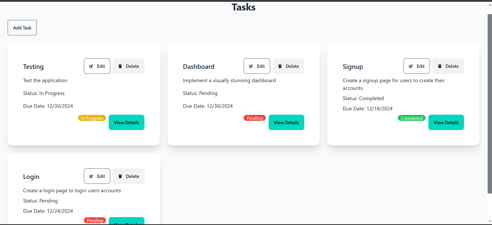
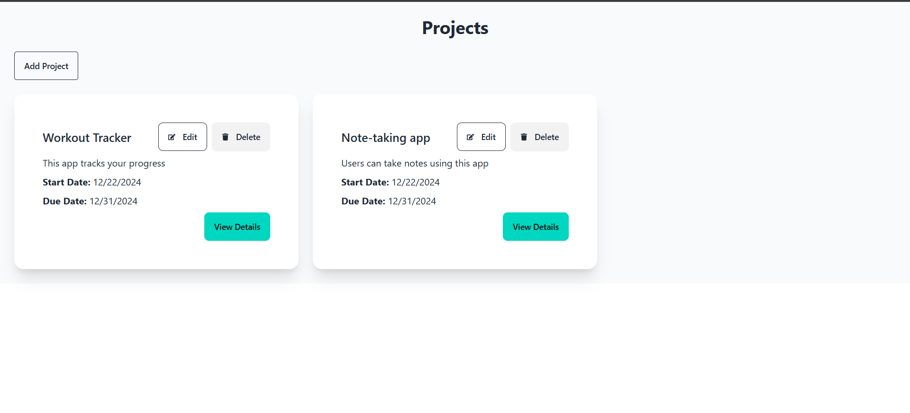
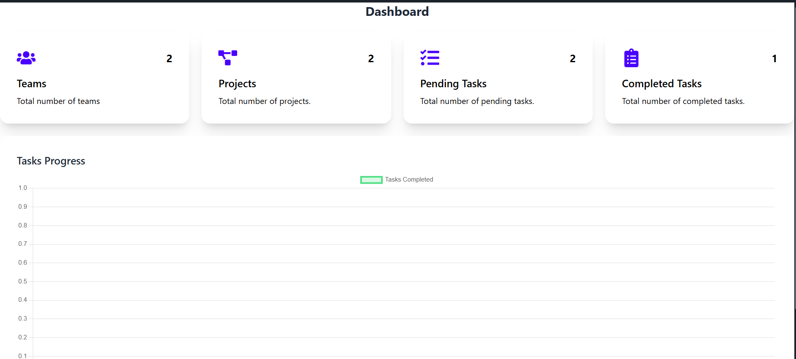
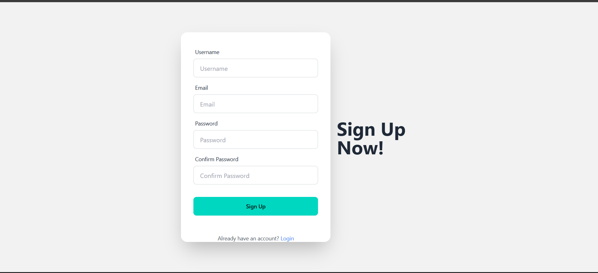
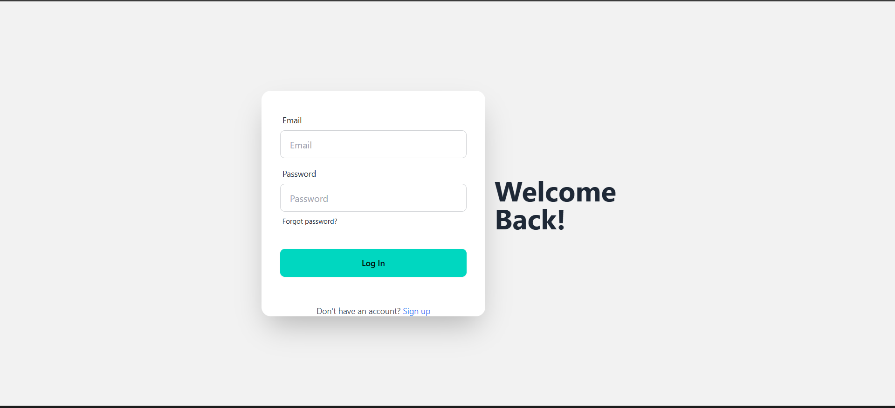

# Project Management System


## Table of Contents
- [Introduction](#introduction)
- [Features](#features)
- [Installation](#installation)
- [Usage](#usage)
- [API Documentation](#api-documentation)
- [Environment Variables](#environment-variables)
- [Contributing](#contributing)
- [License](#license)
- [Contact](#contact)
- [Screenshots](#screenshots)

## Introduction

The **Project Management System** is designed to manage users, projects, teams, and tasks efficiently. It aims to provide a seamless experience for users across various devices.

## Features

- **Team Management**: Create and manage teams, assign roles and responsibilities.
- **Task Management**: Create, assign, track, and update tasks.
- **Project Management**: Manage project details, timelines, and milestones.
- **Dashboard Page**: A comprehensive dashboard for overview and analytics.
- **User Management**: Manage user profiles, roles, and permissions.
- **User Authentication**: Secure user login and registration using JWT.

## Installation

Step-by-step instructions to set up the project locally:

1. **Clone the Repository**:
    ```bash
    git clone https://github.com/Durga1534/project-management.git
    ```
2. **Navigate to the Project Directory**:
    ```bash
    cd project-management
    ```
3. **Install Dependencies**:
    ```bash
    npm install
    ```

## Usage

Instructions to run and use the project:

1. **Start the Development Server**:
    ```bash
    npm run dev
    ```
2. **Open Your Browser** and navigate to `http://localhost:8080`.

## API Documentation

Detailed API documentation:

### Example Endpoint
- **URL**: `/api/users`
- **Method**: `GET`
- **Description**: Retrieves user details with username, email, and role.
- **Response**:
    ```json
    {
      "data": [
        {
          "username": "exampleUser",
          "email": "example@mail.com",
          "role": "admin"
        }
      ]
    }
    ```

## Environment Variables

List of required environment variables:

| Variable       | Description                       |
|----------------|-----------------------------------|
| `VITE_API_URL` | URL of the backend API            |
| `JWT_SECRET`   | Secret key for JWT authentication |
| `MONGO_URI`    | MongoDB connection string         |

## Contributing

Guidelines for contributing to the project:

1. **Fork the Repository**.
2. **Create a New Branch**:
    ```bash
    git checkout -b feature/your-feature-name
    ```
3. **Make Your Changes and Commit Them**:
    ```bash
    git commit -m "Add your feature"
    ```
4. **Push to the Branch**:
    ```bash
    git push origin feature/your-feature-name
    ```
5. **Open a Pull Request**.

## License

This project is licensed under the MIT License. See the [LICENSE](LICENSE) file for more details.

## Contact

For any questions or feedback, feel free to contact:
- **Name**: Durga Prasad
- **Email**: kondurudurgaprasad.2@gmail.com
- **GitHub**: [Durga1534](https://github.com/Durga1534)

## Screenshots

### Homepage


### Team Management


### Task Management


### Project Management


### Dashboard Page


### Signup page


### Login Page

